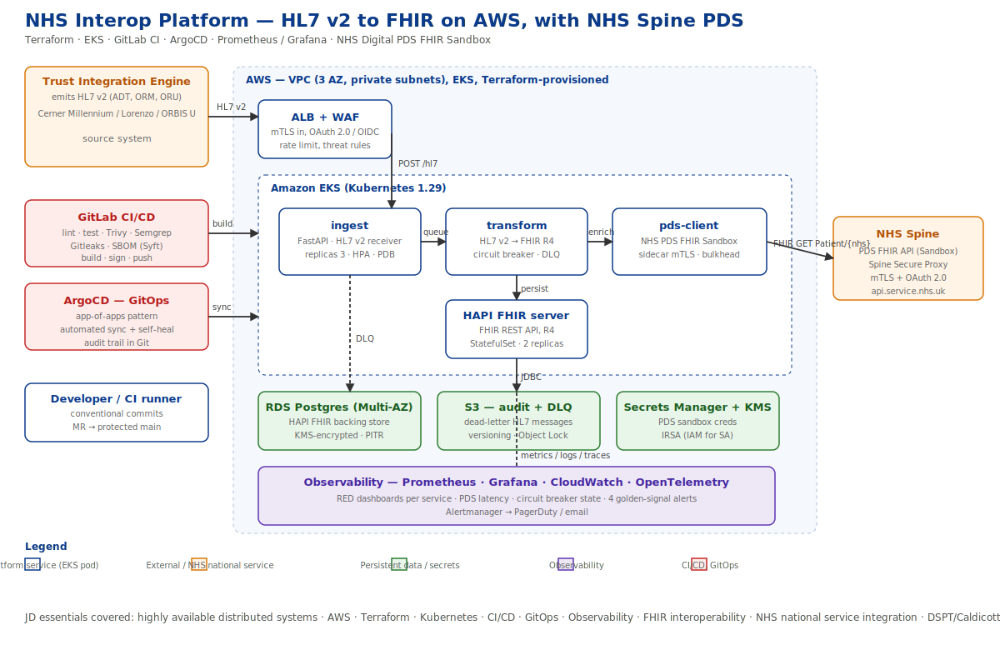
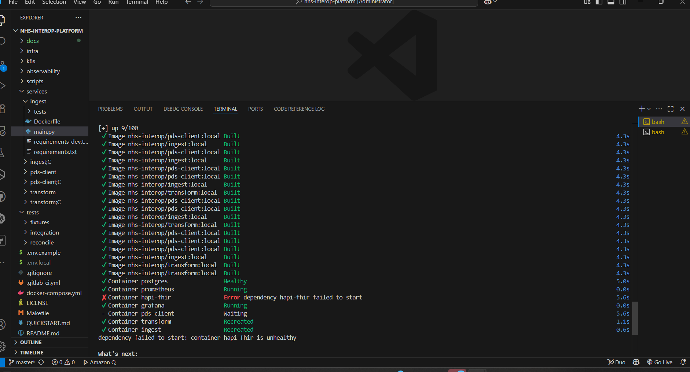
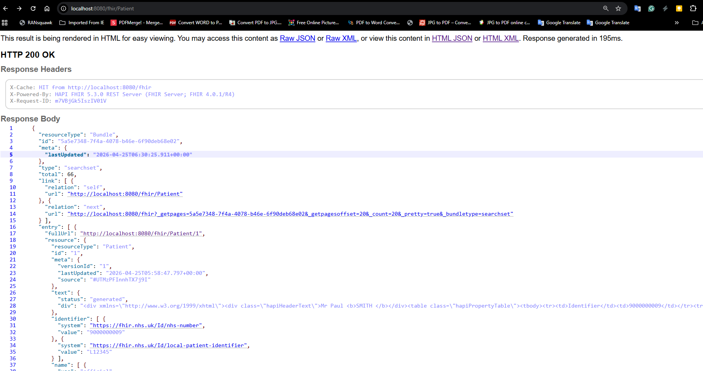
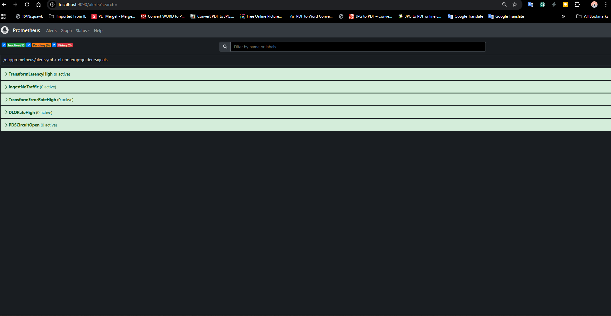

# NHS Interop Platform

```markdown


```

> HL7 v2 to FHIR R4 interoperability service on AWS, with NHS Spine PDS lookup.
> Built as a production-shaped reference implementation of the integration patterns used inside NHS trusts running vendor EPRs (Cerner Millennium, Dedalus Lorenzo/ORBIS U) on AWS.



## Why this exists

NHS trusts running vendor EPRs emit HL7 v2 natively, but the rest of the NHS ecosystem (Spine, FDP, NHS App, analytics) speaks FHIR. Every trust therefore needs an interoperability layer that translates HL7 v2 into FHIR, enriches with authoritative national data (PDS), and exposes a FHIR-compliant REST API. This repository is a small, production-shaped implementation of exactly that layer — runnable locally with one `docker compose up`, deployable to AWS EKS with Terraform, delivered through GitLab CI and ArgoCD, observed with Prometheus and Grafana.

It is deliberately scoped to be **read and understood in a 10-minute interview walkthrough**.

## Quick start

Requires Docker 24+ and `make`.

```bash
git clone https://github.com/<you>/nhs-interop-platform.git
cd nhs-interop-platform
cp .env.example .env.local
make demo               # builds and starts all services
./scripts/send-adt.sh   # sends a sample ADT^A01 to the ingest service
```

Then open:

- FHIR REST API: <http://localhost:8080/fhir/Patient>
- Grafana: <http://localhost:3000> (admin / admin)
- Prometheus: <http://localhost:9090>
- Ingest service: <http://localhost:8000/docs>
- Transform service: <http://localhost:8001/docs>
- PDS client: <http://localhost:8002/docs>

You should see the Patient resource appear in HAPI FHIR within a second, and traffic light up on the Grafana dashboard.

See `docs/` for the full architecture, runbook, security model and HL7→FHIR mapping. See `Interview Prep/` in the parent folder for the interview walkthrough notes.

**Quickstart section** linking to `QUICKSTART.md` for the long version, with a 3-line summary in the README itself.


## Screenshots



*Live Grafana HL7 Pipeline dashboard during a 30-message burst.*



```markdown
### Grafana — HL7 Pipeline dashboard


### Prometheus — all targets UP

```
*HAPI FHIR Patient browser after ingesting an ADT^A01 with NHS number 9000000009.*

## Repository layout

```
.
├── services/
│   ├── ingest/       — FastAPI HL7 v2 receiver
│   ├── transform/    — HL7 v2 → FHIR R4 mapper
│   └── pds-client/   — NHS PDS FHIR Sandbox client
├── infra/terraform/  — AWS VPC, EKS, RDS, S3, KMS, IAM
├── k8s/
│   ├── helm/         — per-service Helm charts
│   └── argocd/       — app-of-apps GitOps definitions
├── observability/    — Prometheus, Grafana, Alertmanager
├── tests/            — unit, integration, reconciliation
├── docs/             — architecture, HL7/FHIR mapping, security, runbook
├── scripts/          — helper scripts (send-adt.sh, reconcile.sh)
├── docker-compose.yml
├── Makefile
└── .gitlab-ci.yml
```

 **Cross-links to the docs folder.** A bulleted list of `docs/architecture.md`, `docs/runbook.md`, `docs/security.md`, `docs/hl7-fhir-mapping.md`, `docs/lessons-learnt.md` — the panel should be able to click straight into any one.


## Licence

MIT. See [LICENSE](LICENSE).
